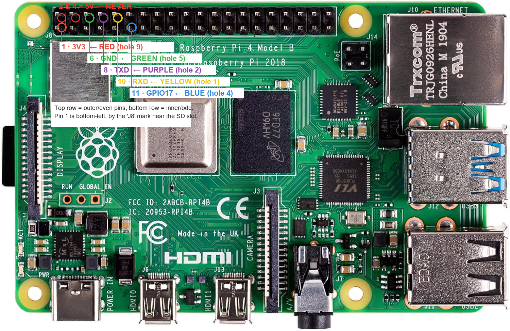

# toniebox-rip-kit

Scripts and a step-by-step guide for putting a **CC3200 Toniebox** (Toniebox 1) on your own
[teddycloud](https://github.com/toniebox-reverse-engineering/teddycloud) server, using a
**Raspberry Pi as the UART adapter** — the part most guides assume you solve with a USB dongle,
which in practice often fails.

This is a written-up record of doing it once, successfully, on a Toniebox 1 "Beere"
(PCB 16.02-MAIN-REV1.2, CC3200R1, original firmware).

**→ [docs/GUIDE.md](docs/GUIDE.md) is the walkthrough.** Everything else here is the code it uses.

## Why a Raspberry Pi instead of a USB-UART adapter

`cc3200tool` needs to send a **serial break** to get the CC3200's ROM bootloader to answer. Many
FT232RL boards sold today (especially the cheap mini-USB and USB-C clones) never pull TX low for
a break, so every command ends in `Did not get ACK on break condition` — even though the reset
works and the boot log reads fine. The RevvoX forum has several threads about this.

A Raspberry Pi's **PL011 UART** on the GPIO header does it correctly. The only thing the header
lacks is DTR/RTS for the reset, so a GPIO pin drives RST instead. That is all `pi/link.sh` does.

A CP2102 board or a DSD TECH SH-U09C5 cable are reported to work too — if you already own one,
you do not need the Pi.

## What is in here

| Path | What |
|---|---|
| `docs/GUIDE.md` | the whole process, start to finish |
| `docs/TROUBLESHOOTING.md` | error messages and what they actually mean |
| `docs/img/` | debug-port location, pad numbering, Pi header wiring |
| `pi/setup-pi.sh` | prepares a fresh Pi: frees the PL011 UART, installs `cc3200tool` |
| `pi/link.sh` | pulses RST on GPIO17, then runs `cc3200tool` on `/dev/ttyAMA0` |
| `pi/backup.sh` | full flash + filesystem backup (do this first, always) |
| `pi/dump-certs.sh` | pulls `ca.der`, `client.der`, `private.der` off the box |
| `pi/flash-ca.sh` | writes your teddycloud CA onto the box |
| `pi/restore-ca.sh` | puts the original CA back (box returns to Boxine) |
| `teddycloud/` | container launch example, cert install, pin/fetch/rip helpers |
| `dns/` | pointing the two Boxine domains at teddycloud |

## Before you start

- **Back up first.** `pi/backup.sh` produces a 4 MB flash image and a copy of the filesystem.
  Without it, a bad write can leave you with a box that no longer boots and no way back.
- **3.3 V only.** The debug port is 3.3 V logic. Feeding it 5 V kills the CC3200.
- **Leave the box on its own battery.** Do not power it from the adapter's VCC pin.
- Opening the box voids the warranty, and everything here is at your own risk.
- No audio is included or produced by this repo. It moves *your* box's own credentials so *your*
  server can serve *your* content.

## Credits

All of the hard reverse-engineering is other people's work: the
[Toniebox reverse engineering](https://github.com/toniebox-reverse-engineering) project
(teddycloud, cc3200tool fork, the wiki at <https://tonies-wiki.revvox.de>). This repo is just the
assembly instructions for one specific path through it.

Independent hobby project, not affiliated with tonies GmbH / Boxine.
