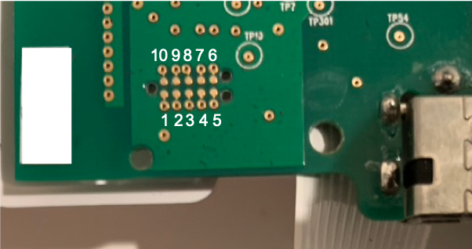
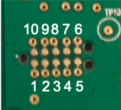
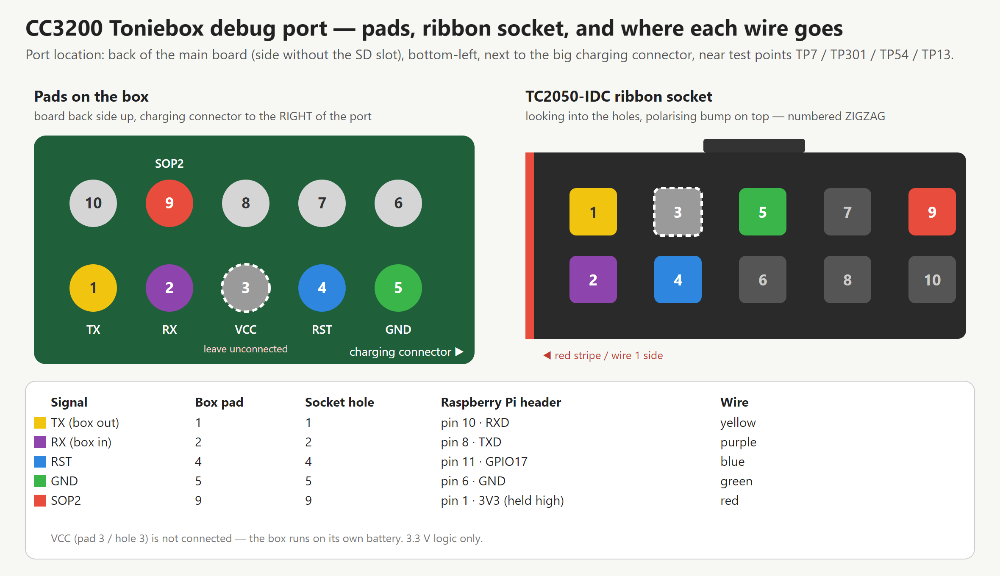
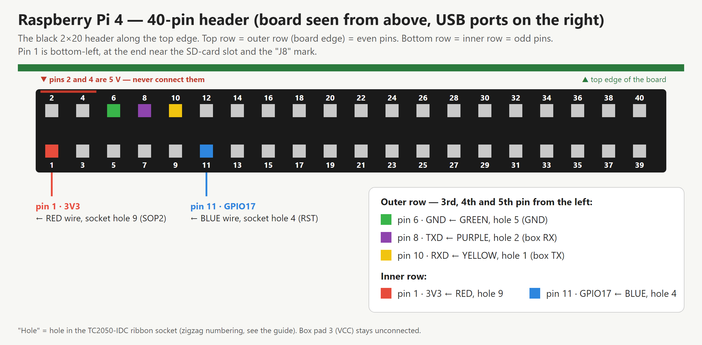

# Guide — CC3200 Toniebox onto teddycloud, with a Raspberry Pi

Start to finish, in the order that works. Allow an evening for the first time; the hardware part
itself takes about half an hour once everything is wired.

1. [What you need](#1-what-you-need)
2. [Set the box up normally first](#2-set-the-box-up-normally-first)
3. [Check it is a CC3200 box](#3-check-it-is-a-cc3200-box)
4. [Prepare the Raspberry Pi](#4-prepare-the-raspberry-pi)
5. [Open the box and find the debug port](#5-open-the-box-and-find-the-debug-port)
6. [Wire the ribbon to the Pi](#6-wire-the-ribbon-to-the-pi)
7. [Test the link](#7-test-the-link)
8. [Back up everything](#8-back-up-everything)
9. [Dump the certificates into teddycloud](#9-dump-the-certificates-into-teddycloud)
10. [Flash teddycloud's CA](#10-flash-teddyclouds-ca)
11. [Redirect DNS and boot normally](#11-redirect-dns-and-boot-normally)
12. [Rip your figurines](#12-rip-your-figurines)
13. [Coins (blank tags)](#13-coins-blank-tags)
14. [Going back](#14-going-back)

---

## 1. What you need

| Item | Notes |
|---|---|
| **Tag-Connect TC2050-IDC-NL** | the 10-pin pogo cable for the box's debug pads. "NL" = no legs: you hold it on the pads by hand. Genuine one from DigiKey/Mouser ~CHF/EUR 35; clones exist and are slow to arrive. |
| **Raspberry Pi** (4 tested; 3B/5 should work) | with Raspberry Pi OS on an SD card and SSH access |
| **5 Dupont jumper wires, male–female** | the ribbon's 2×5 socket is 2.54 mm pitch: male ends go straight into it, female ends onto the Pi header |
| a Torx T8 / small Phillips set and a plastic spudger | to open the box |
| teddycloud already running on a server | Docker, with its web UI reachable on your LAN |
| control over your LAN's DNS | Pi-hole, AdGuard, router DNS overrides, … |

You do **not** need a USB-UART adapter. If you already have a CP2102 board you can use it instead
of the Pi — see the README for why many FT232RL boards do not work.

## 2. Set the box up normally first

Do the official setup with the tonies app **before** touching anything:

- Wi-Fi, account
- **region / language** — this decides which language version of each figurine gets downloaded
- let it **update its firmware**
- play one figurine to be sure the box works

> Do **not** add the DNS redirect (step 11) yet. With it active, a factory box cannot reach the
> real cloud, cannot finish setup, and just blinks red with the "no connection to the cloud" error.

## 3. Check it is a CC3200 box

This guide is for the **CC3200** (Toniebox 1, most boxes up to around 2023). ESP32 and CC3235
boxes need different procedures (see the teddycloud wiki).

- No MAC address printed under the box's cap → almost certainly CC3200.
- The chip marking on the main board, once open, is the certain answer: **CC3200R1**.

## 4. Prepare the Raspberry Pi

Copy this repo to the Pi and run the setup once:

```bash
git clone <this repo> ~/toniebox-rip-kit
cd ~/toniebox-rip-kit/pi
./setup-pi.sh
sudo reboot
```

What it changes and why:

| Change | Why |
|---|---|
| `enable_uart=1` in `config.txt` | switches the header UART on |
| `dtoverlay=disable-bt` | gives the good **PL011** UART to the header (otherwise Bluetooth has it and `/dev/ttyAMA0` is the weaker mini-UART) |
| serial console removed from `cmdline.txt` | otherwise Linux prints a login prompt into your box session |
| `cc3200tool` in `~/cc3200` | the tool that talks to the CC3200 ROM bootloader |
| user added to `dialout` | permission for `/dev/ttyAMA0` |

After the reboot, `ls -l /dev/ttyAMA0` must exist.

## 5. Open the box and find the debug port

Remove the bottom, take the electronics out, and unplug the speaker, the NFC/ear board and the
battery connector as needed to lift the main board. **Keep the battery connected** (or the box on
its charger) while working — the box must run on its own power.

The debug port is on the **back of the main board** (the side without the SD slot), bottom-left,
right next to the big charging connector, inside a small rounded outline among test points
TP7 / TP301 / TP54 / TP13.



Pad numbering, with the board back side up and the charging connector to the right of the port:

```
 top row:    10  9  8  7  6
 bottom row:  1  2  3  4  5      <- pad 1 = bottom-left
```



Only five pads are used:

| Pad | Signal |
|---|---|
| 1 | TX (from the box) |
| 2 | RX (into the box) |
| 4 | RST (reset, active low) |
| 5 | GND |
| 9 | SOP2 (high at reset = bootloader mode) |

Pad 3 is the box's 3.3 V rail — leave it alone.

## 6. Wire the ribbon to the Pi

**The ribbon socket is numbered zigzag, not like the pads.** Looking into the socket holes with the
polarising bump at the top:

```
top row:      1   3   5   7   9      (1 = top-left, next to the red-stripe wire)
bottom row:   2   4   6   8  10
```

Wire N on the ribbon = pad N on the box = socket hole N.



Connect:

| Socket hole | Box signal | Pi header pin | Suggested wire colour |
|---|---|---|---|
| **1** | TX | **pin 10** — RXD (GPIO15) | yellow |
| **2** | RX | **pin 8** — TXD (GPIO14) | purple |
| **4** | RST | **pin 11** — GPIO17 | blue |
| **5** | GND | **pin 6** — GND | green |
| **9** | SOP2 | **pin 1** — 3V3 | red |

TX goes to RX and RX to TX (crossed). SOP2 on 3V3 is permanent for the whole session: every reset
then lands in the bootloader.


Pin numbering on the Pi header: pin 1 is at the corner by the SD-card slot, **odd pins on the inner
row, even pins on the outer row** (board edge).



> **Pins 2 and 4 are 5 V.** A wire on either of them into the box ends it. Double-check before
> powering anything.

## 7. Test the link

Press the TC2050 plug firmly and squarely onto the pads (pin 1 of the plug on pad 1), and on the Pi:

```bash
~/rip/link.sh list_filesystem
```

`link.sh` pulls RST low on GPIO17 for 0.3 s, releases it, waits a second for the bootloader, then
runs `cc3200tool` on `/dev/ttyAMA0`. A good result is a list of files including `/cert/ca.der`.

**Bootloader indicator:** after the reset the box LED stays **steady green and silent** (no
startup jingle). A jingle means SOP2 was not high during the reset → check the red wire and the
plug pressure.

Not working? → [TROUBLESHOOTING.md](TROUBLESHOOTING.md).

## 8. Back up everything

```bash
~/toniebox-rip-kit/pi/backup.sh
```

You get `~/rip/backup/` (the filesystem) and `~/rip/backup.bin` (the 4 MB raw flash, with a
sha256). **Copy both off the Pi now** — to your server, a NAS, anywhere. They are your only way
back.

## 9. Dump the certificates into teddycloud

```bash
~/toniebox-rip-kit/pi/dump-certs.sh
```

This creates `~/rip/cert/ca.der`, `client.der`, `private.der`. `private.der` is your box's private
key: treat it like a password.

Install them into teddycloud (on the teddycloud host, or pass the host with `scp`):

```bash
~/toniebox-rip-kit/teddycloud/install-certs.sh ~/rip/cert  <box-id>
```

`<box-id>` is the box's MAC without separators, lower case (e.g. `b4107baabbcc`). The script puts
the files both in `certs/client/` and in `certs/client/<box-id>/` — recent teddycloud versions look
in the per-box folder — then restarts the container.

## 10. Flash teddycloud's CA

Copy teddycloud's CA to the Pi as `~/rip/teddycloud-ca.der` (it is `certs/server/ca.der` on the
teddycloud host), then:

```bash
~/toniebox-rip-kit/pi/flash-ca.sh ~/rip/teddycloud-ca.der
```

The script refuses to run if the original CA was not dumped, writes the new one, reads it back and
compares. On the tested box the CA lives at **`/cert/ca.der`** (there was no `c2.der`); override
with `TARGET=/cert/c2.der` if your filesystem listing shows otherwise.

## 11. Redirect DNS and boot normally

Now, and only now, point the two Boxine hostnames at teddycloud's box-facing IP:

```
prod.de.tbs.toys  -> <teddycloud IP>
rtnl.bxcl.de      -> <teddycloud IP>
```

See [../dns/README.md](../dns/README.md) for Pi-hole and other resolvers, and for the pitfalls
(blocklists, cached answers, and teddycloud needing its own upstream DNS).

Then:

1. **pull the SOP2 wire** off (or just remove the TC2050 plug)
2. reassemble loosely and **power-cycle** the box (fully off — it caches DNS)
3. within a minute it appears in the teddycloud web UI under *Tonieboxes*

## 12. Rip your figurines

With `cloud.enabled` in teddycloud, placing a figurine makes the box download it from Boxine
*through* teddycloud, which keeps a copy (`library/by/audioID/<id>.taf`). One figurine, one minute.

Gotchas from doing it:

- **teddycloud needs a real upstream DNS.** If its container uses your redirected DNS, it resolves
  `prod.de.tbs.toys` to itself and every download fails. Start the container with `--dns 1.1.1.1`
  (see `teddycloud/run.sh.example`).
- **Pin each figurine after its download** so freshness checks stop re-downloading and the box does
  not drop the stream: `teddycloud/tc_pin.sh <content-dir> <audio-id>`.
- **Wrong language?** The version that downloads is the one selected in the tonies app at that
  moment. Change it in the app, then `teddycloud/tc_rip_lang.sh <content-dir>` pulls the new one.
- `teddycloud/taf_ids.py file.taf` prints the audio-id / hash / size / track count of any TAF.

## 13. Coins (blank tags)

Only **ICODE SLIX-L** tags with a UID starting `E0 04 03` work on an unmodified box.

1. **Read the coin's UID with a phone first** if you want it on a phone app too — after its first
   placement the box switches the tag into privacy mode and phones can no longer read it.
2. Put the coin on the box: it appears in teddycloud (*Tonies*, filter "last played").
3. *Edit* → pick any library file → save.
4. Place it again: the box downloads it once and plays it offline from then on.

## 14. Going back

```bash
~/toniebox-rip-kit/pi/restore-ca.sh      # original CA back onto the box
```

and remove the two DNS records. The box then talks to Boxine again. If something worse happened,
`backup.bin` is a full image of the flash.
